# Congress-Symposium Application Project

## Application, registration, evaluation, referrals to referees, and informing the participants of the results of international and national online congresses and symposiums held in a University

### Using ASP.NET MVC5 Entity Framework 6

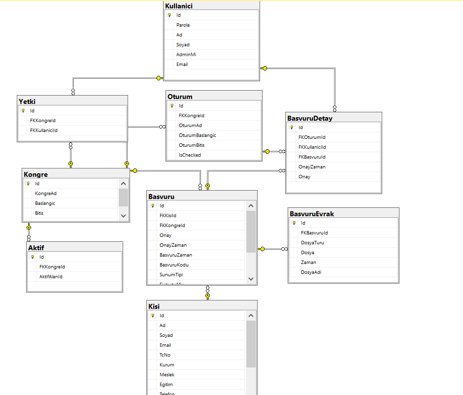

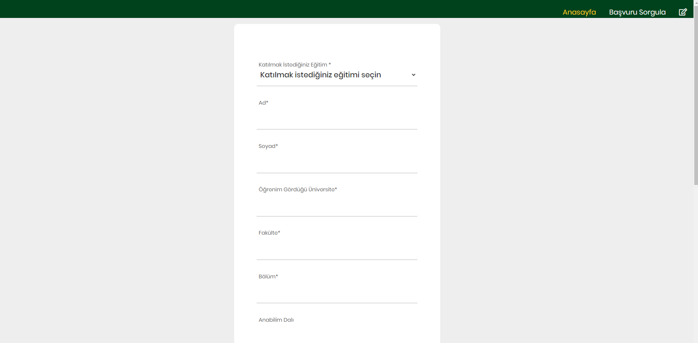

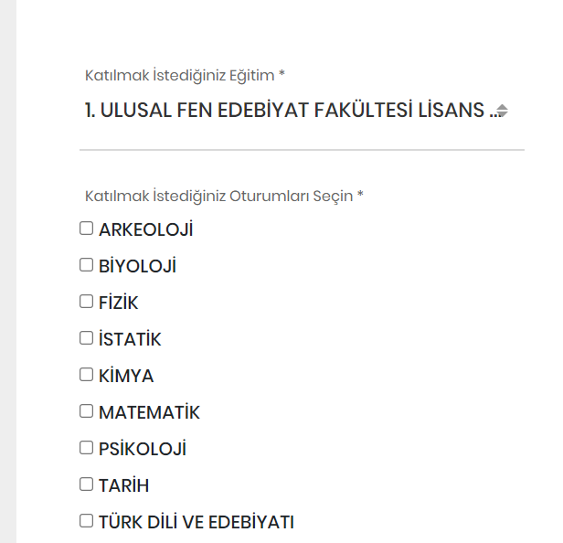

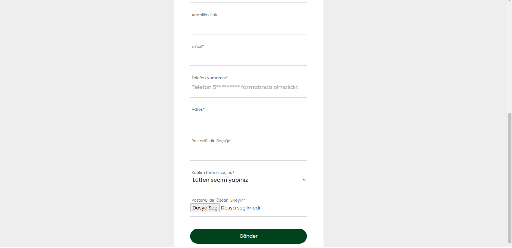

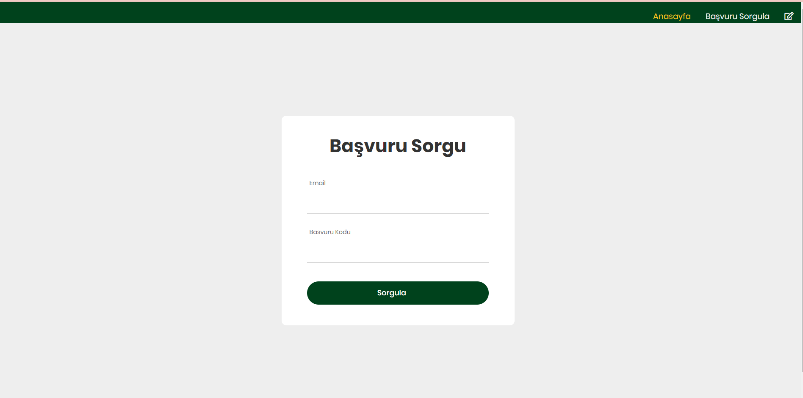

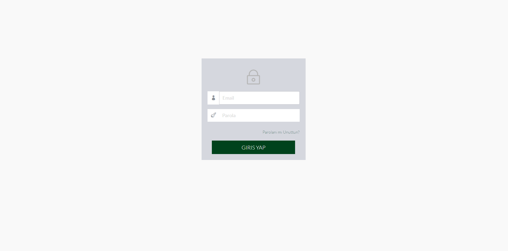

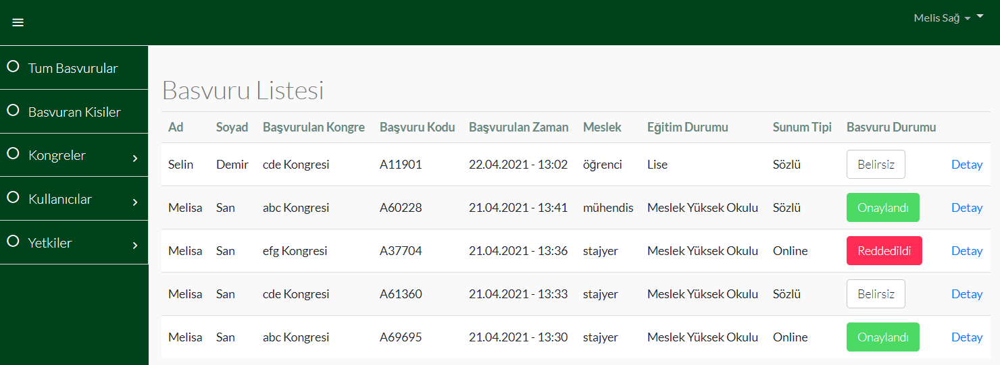

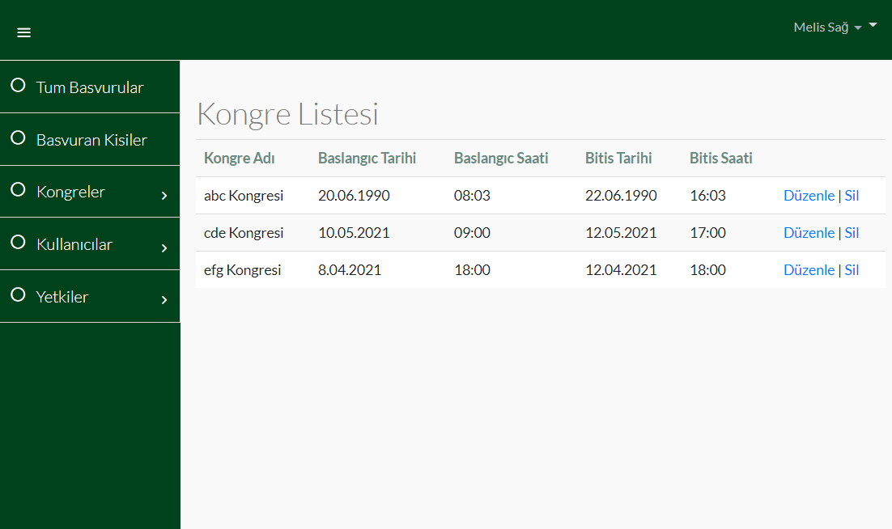

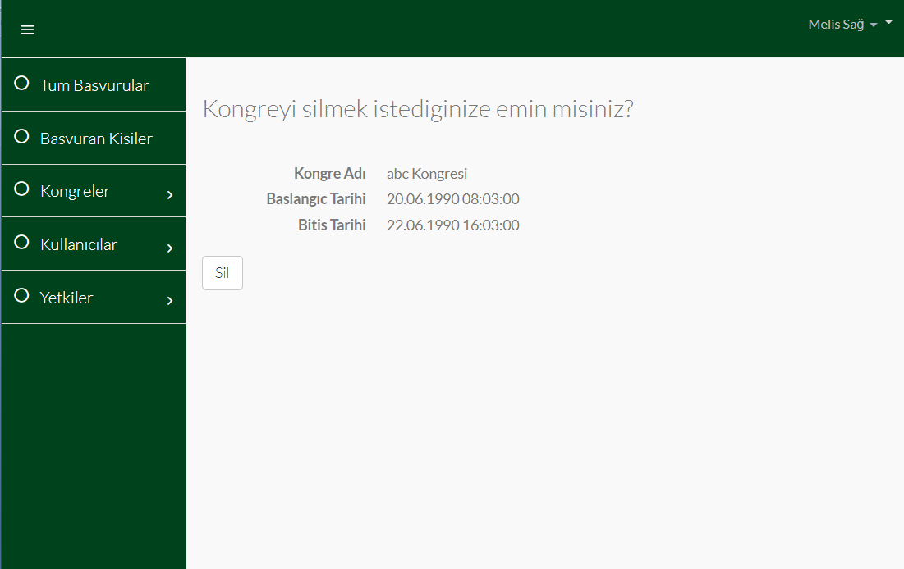

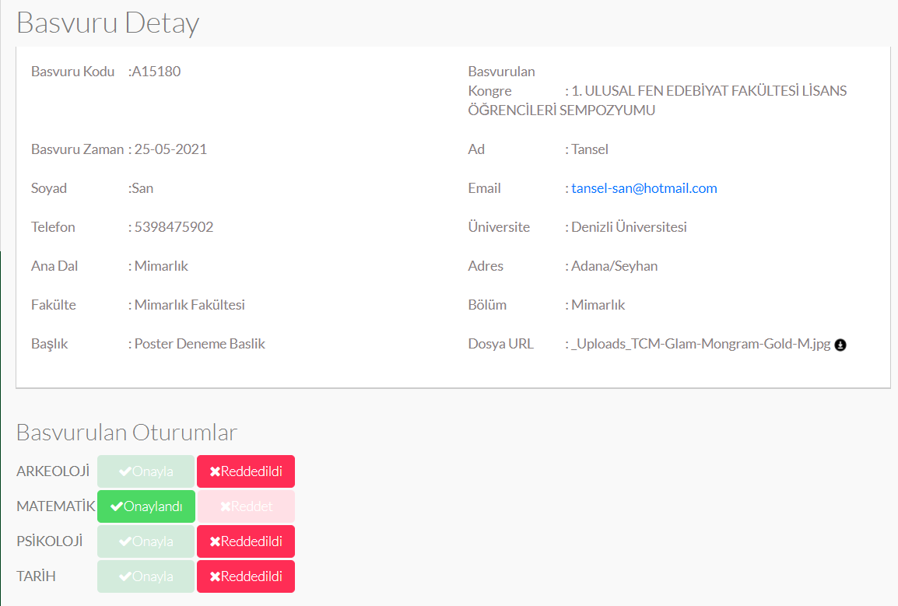

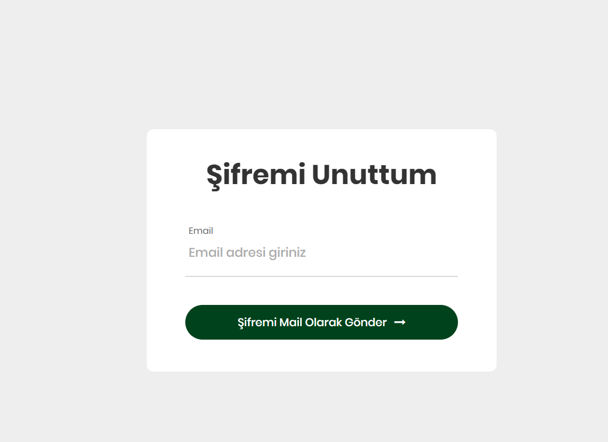

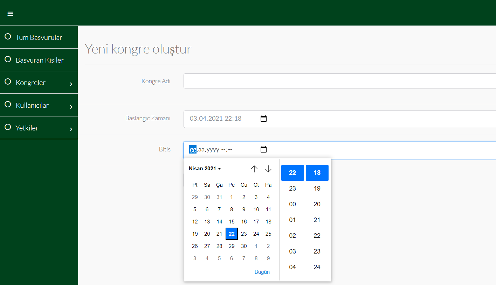

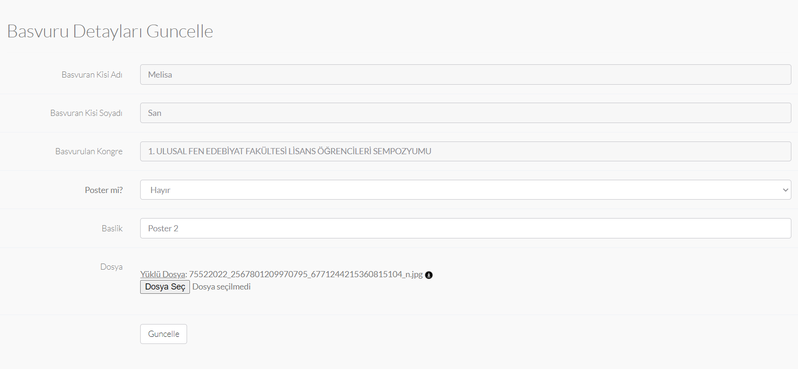